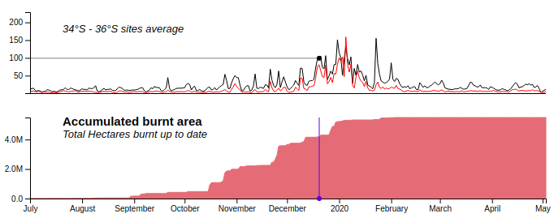

# Australian 2019-2020 bushfires and air-quality effects explorer

The 2019-2020 summer bushfires were unprecedented. They devastated a huge area of SE Australia, taking human lives, destroying homes and infrastructure, covering cities in smoke and casuing a tremendous loss of wildlife flora and fauna. 
From the human health point of view, air pollution caused by bushfires can mean high risk to the population. One of the 10 major health risks in Australia relate to air pollution (mostly particulate matter pollution). 

Given the relevance that bushfire impact has on air-quality conditions, potentially resulting in negative consequences over human population, a simple interactive tool was developed to further explore the Australian 2019-2020 summer bushfires behaviour in space and time, and the corresponding effect on the atmospheric concentration of particulate matter (MP10 and MP2.5, in particular). 

## Tool purpose
The tool was developed to the only purpose of giving the user a way to better understand the space-time dynamic of the mentioned bushfires along with the atmospheric particulate matter concentration behaviour. 

## Intended audience
Although all kind of audiences are welcome to explore the interactive dashboard, it was developed for users with some technical background, familiar to graphic data representations and maps.

## Final notes
The interactive dashboard was developed in 2020 as an assignment for the Data Visualisation unit of the Master of Data Science course at Monash University.
The purpose of this README file is to provide a general overview of the tool and a basic user guide for the bushfires/air-quality relationship exploration.

# User guide
The below image shows the interactive dashboard. It includes a map with fires represented as polygons, air-quality line plots for different latitudinal sections of NSW (aligned with the map everytime the dashboard is refreshed), and a bar plot indicating the frequency of fires started per day, from July 2019 to May 2020.

To the right side of the screen, the tool displays informative text suggesting an interaction workflow that allows to explore the information in an organised manner. The text appears along with the user interaction, although it is not necessary to follow these instructions to start interacting.

## Active fires bar plot
This plot is the central feature of the visualisation. It acts as the main discovery instrument, since bars can be hovered over and also clicked.
When hovered over, a tooltip will be displayed indicating the corresponding date selected, the number of fires started that day and also the exact number of active fires by that date.

At the same time, hovering over the bars will display a vertical line in the air quality line plots, indicating the corresponding date (see below image, right). This way, the user can straightforwardly explore the effect of the amount of active fires on air pollution levels. Fires started the day of the corresponding hovered bar will be highlighted in the map in red colour (see below image, left).

By clicking on a bar on any given day, the map will display fires only from past days up to the selected date. Active fires will be displayed in red, while already extinguished fires will be shown in black (see image below). The blue vertical indicator in the air quality plots will remain displayed while the user interacts with the map, exploring active and inactive fires. Clicking again on any bar will restore the dashboard to its original state.

## Map
The implemented map is based on the Leaflet javascript library, so interactions with it include dragging and zooming in/out. Hovering over fire polygons will show a tooltip with name and date period of the corresponding fire, and also the area this fire burned. Polygons are highlighted in red when hovered over.

## Air-quality plots
Finally, interaction with air quality plots is very simple. On hover, they will display a horizontal bar from the current value to the y-axis, allowing the user to get a rough idea of the PM10 atmospheric concentration. Simultaneously, a vertical indicator will be displayed accordingly in the accumulated burnt area plot to facilitate comparison between pollution concentration and already burnt hectares in the study area (see image below).

